# [Chest X-ray (Covid-19 & Pneumonia)](https://www.kaggle.com/prashant268/chest-xray-covid19-pneumonia/)
COVID-19 (coronavirus disease 2019) is an infectious disease caused by severe acute respiratory syndrome coronavirus 2 (SARS-CoV-2), a strain of coronavirus. The first cases were seen in Wuhan, China, in late December 2019 before spreading globally. The current outbreak was officially recognized as a pandemic by the World Health Organization (WHO) on 11 March 2020. Currently Reverse transcription polymerase chain reaction (RT-PCR) is used for diagnosis of the COVID-19. X-ray machines are widely available and provide images for diagnosis quickly so chest X-ray images can be very useful in early diagnosis of COVID-19.
In this classification project, there are three classes:
- COVID19
- PNEUMONIA
- NORMAL


## Data description
Dataset is organized into 2 folders (train, test) and both train and test contain 3 subfolders (COVID19, PNEUMONIA, NORMAL) one for each class. DataSet contains total 6432 x-ray images and test data have 20% of total images. As a start, it is very important to inspect the data across the three classes:

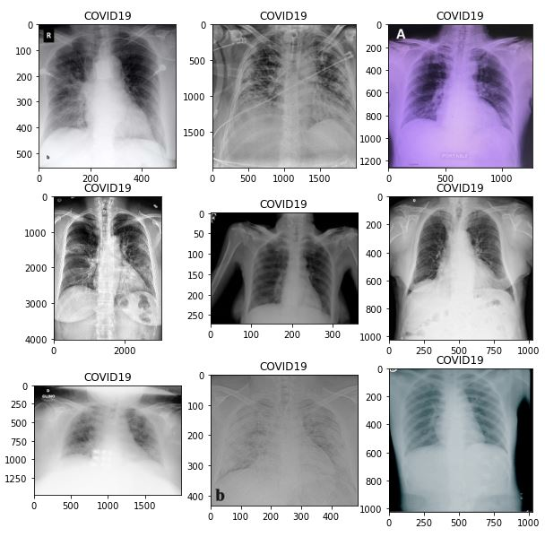
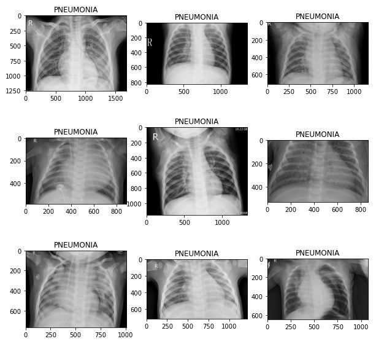
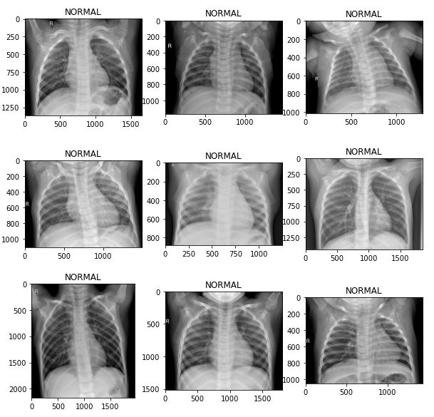

It is clear that images are at different sizes. 

## Data scaling, normalization and augmentation 
Based on data inspection, images are scaled to a size of 244 by 244, normalized to values (0,1) and augmented by simple zoom and rotation to enhance the generalization.    

```
image_size = 224 
BATCH_SIZE = 16 

data_path = '/kaggle/input/chest-xray-covid19-pneumonia/Data'

train_datagen = ImageDataGenerator(rescale = 1./255,
                                   zoom_range = 0.2,
                                   rotation_range=15,
                                   horizontal_flip = True)

test_datagen = ImageDataGenerator(rescale = 1./255)

training_set = train_datagen.flow_from_directory(data_path + '/train',
                                                 target_size = (image_size, image_size),
                                                 batch_size = BATCH_SIZE,
                                                 class_mode = 'categorical',
                                                 shuffle=True)

testing_set = test_datagen.flow_from_directory(data_path + '/test',
                                            target_size = (image_size, image_size),
                                            batch_size = BATCH_SIZE,
                                            class_mode = 'categorical',
                                            shuffle = True)

```

Accordingly, the dataset shape is as follows: 

```
print("train batch ", training_set.__getitem__(0)[0].shape)
print("test batch ", testing_set.__getitem__(0)[0].shape)
print("sample train label \n", training_set.__getitem__(0)[1][:5])
```

- train batch  (16, 224, 224, 3)
- test batch  (16, 224, 224, 3)
- sample train label 
 [[0. 0. 1.]
 [0. 1. 0.]
 [0. 1. 0.]
 [1. 0. 0.]
 [0. 0. 1.]]


It is also important to understand the one-hot-encoding

```
training_set.class_indices
```
- {'COVID19': 0, 'NORMAL': 1, 'PNEUMONIA': 2}

Testset sample after data preparation:

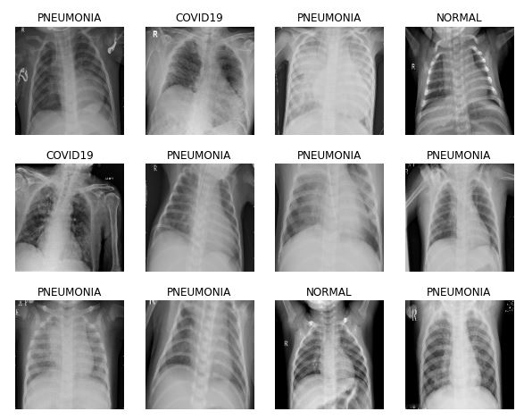

## Training Tips

It is usually important to use callbacks while training. For example:
- ReduceLROnPlateau: Reduce learning rate when a metric has stopped improving
- EarlyStopping: Stop training when a monitored metric has stopped improving

```
lr_reduce = tf.keras.callbacks.ReduceLROnPlateau(monitor='val_loss', factor=0.5, epsilon=0.0001, patience=3, verbose=1)
es_callback = tf.keras.callbacks.EarlyStopping(monitor='val_loss', patience=5, verbose=1)
```

## Label smoothing
[Label smoothing](https://www.linkedin.com/pulse/label-smoothing-solving-overfitting-overconfidence-code-sobh-phd/) is a mechanism for encouraging the model to be less confident. Instead of minimizing cross-entropy with hard targets (one-hot encoding), we minimize it using soft targets, this usually leads to a better generalization.

```
def categorical_smooth_loss(y_true, y_pred, label_smoothing=0.1):
    loss = tf.keras.losses.categorical_crossentropy(y_true, y_pred, label_smoothing=label_smoothing)
    return loss
```

## Understanding Results through visualization  

**Class Activation Map (CAM)** visualization techniques produce heatmaps of 2D class activation over input images, showing how important each location is for the considered class. In the paper [Grad-CAM: Why did you say that? Visual Explanations from Deep Networks via Gradient-based Localization](https://arxiv.org/abs/1610.02391), the visualization is conducted by taking the output feature map of a convolution layer (given an input image), and then weighing every channel (feature map) by the gradient of the output class wrt the feature map.

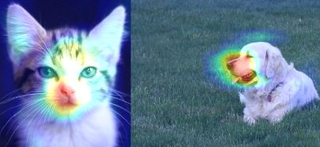


## Transfer Learning

Instead of starting from scratch, **Transfer Learning** is used by loading a generic and well trained image classification network for feature extraction, and then adding few layers (head) to be trained for the target task. Three pretrained networks are used: 

- [DenseNet](https://arxiv.org/abs/1608.06993)
- [EfficientNetB7](https://arxiv.org/abs/1905.11946)
- [VGG16](https://arxiv.org/abs/1409.1556)

Steps: 
- The pretrained network is loaded without the final classifcation head.
- Freeze the weights of the pretrained network.
- Add new head layers to be trained.

### DenseNet201

```
pretrained_densenet = tf.keras.applications.DenseNet201(input_shape=(image_size, image_size, 3), weights='imagenet', include_top=False)

for layer in pretrained_densenet.layers:
  layer.trainable = False

x1 = pretrained_densenet.output
x1 = tf.keras.layers.AveragePooling2D(name="averagepooling2d_head")(x1)
x1 = tf.keras.layers.Flatten(name="flatten_head")(x1)
x1 = tf.keras.layers.Dense(64, activation="relu", name="dense_head")(x1)
x1 = tf.keras.layers.Dropout(0.5, name="dropout_head")(x1)
model_out = tf.keras.layers.Dense(3, activation='softmax', name="predictions_head")(x1)

model_densenet = Model(inputs=pretrained_densenet.input, outputs=model_out)
model_densenet.compile(optimizer=tf.keras.optimizers.Adam(learning_rate=0.0001),loss=categorical_smooth_loss,metrics=['accuracy'])
model_densenet.summary()
```
- Trainable params: **1,106,179**

```
history_densenet = model_densenet.fit_generator(training_set, validation_data=testing_set, callbacks=[lr_reduce, es_callback], epochs=30) 
```

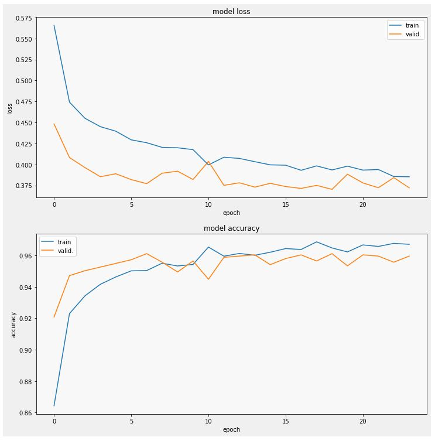


- val_accuracy: **0.9596** (very good as a start indeed)

Sampe test results:

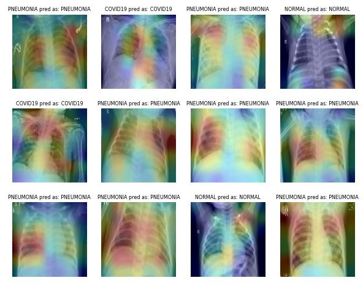


### EfficientNetB7

```
pretrained_efnet = efn.EfficientNetB7(input_shape=(image_size, image_size, 3), weights='noisy-student', include_top=False)

for layer in pretrained_efnet.layers:
  layer.trainable = False

x2 = pretrained_efnet.output
x2 = tf.keras.layers.AveragePooling2D(name="averagepooling2d_head")(x2)
x2 = tf.keras.layers.Flatten(name="flatten_head")(x2)
x2 = tf.keras.layers.Dense(64, activation="relu", name="dense_head")(x2)
x2 = tf.keras.layers.Dropout(0.5, name="dropout_head")(x2)
model_out = tf.keras.layers.Dense(3, activation='softmax', name="predictions_head")(x2)

model_efnet = Model(inputs=pretrained_efnet.input, outputs=model_out)
model_efnet.compile(optimizer=tf.keras.optimizers.Adam(learning_rate=0.0001),loss=categorical_smooth_loss,metrics=['accuracy'])
model_efnet.summary()
```

- Trainable params: **1,474,819**

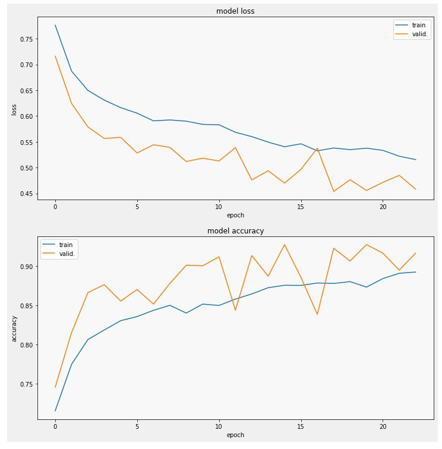


- val_accuracy: **0.9169**

Sampe test results:

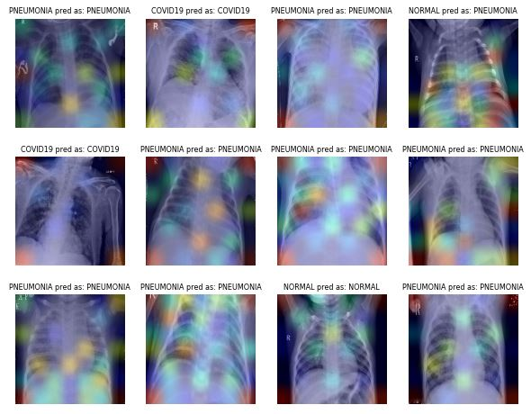

### VGG16

```
pretrained_vgg = tf.keras.applications.VGG16(input_shape=(image_size, image_size, 3), weights='imagenet', include_top=False)

for layer in pretrained_vgg.layers:
  layer.trainable = False

x3 = pretrained_vgg.output
x3 = tf.keras.layers.AveragePooling2D(name="averagepooling2d_head")(x3)
x3 = tf.keras.layers.Flatten(name="flatten_head")(x3)
x3 = tf.keras.layers.Dense(128, activation="relu", name="dense_head")(x3)
x3 = tf.keras.layers.Dropout(0.5, name="dropout_head")(x3)
x3 = tf.keras.layers.Dense(64, activation="relu", name="dense_head_2")(x3)
x3 = tf.keras.layers.Dropout(0.5, name="dropout_head_2")(x3)
model_out = tf.keras.layers.Dense(3, activation='softmax', name="predictions_head")(x3)

model_vgg = Model(inputs=pretrained_vgg.input, outputs=model_out)
model_vgg.compile(optimizer=tf.keras.optimizers.Adam(learning_rate=0.0001),loss=categorical_smooth_loss,metrics=['accuracy'])
# model_vgg.compile(optimizer=tf.keras.optimizers.Adam(learning_rate=0.0001),loss="categorical_crossentropy",metrics=['accuracy'])
model_vgg.summary()
```

- Trainable params: **598,403**

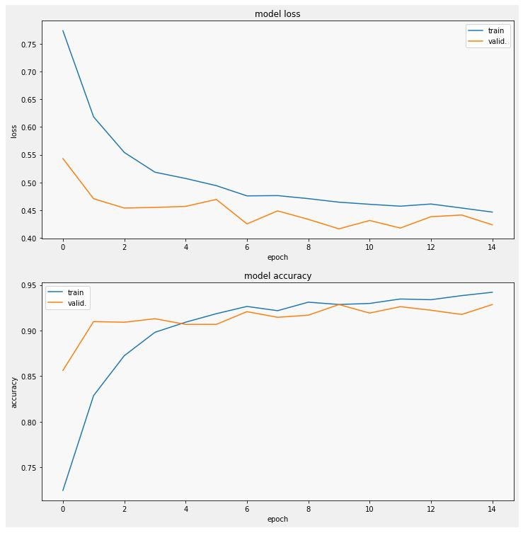


- val_accuracy: **0.9286**

Sampe test results:

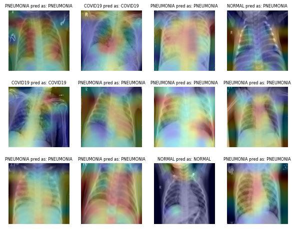


## Ensemble Learning 

In Ensemble learning, multiple models, such as classifiers, are combined together to improve the performance.

### Ensemble at the probability level

In this setup, the network tries to find a combination of the final probs to come up with a better model. This is not the best way, but very simple where we have only **30** trainable parameters.

```
for layer in model_densenet.layers:
  layer.trainable = False

for layer in model_efnet.layers:
  layer.trainable = False

for layer in model_vgg.layers:
  layer.trainable = False

visible = tf.keras.layers.Input(shape=(image_size, image_size, 3), name="input")
x1 = model_densenet(visible)
x2 = model_efnet(visible)
x3 = model_vgg(visible)
merge = tf.keras.layers.concatenate([x1, x2, x3], name="concatallprobs")
model_out = tf.keras.layers.Dense(3, activation='softmax', name="predictions")(merge)

model_densenet_efnet_vgg = Model(inputs=visible, outputs=model_out)
model_densenet_efnet_vgg.compile(optimizer=tf.keras.optimizers.Adam(learning_rate=0.0001),loss='categorical_crossentropy',metrics=['accuracy'])
model_densenet_efnet_vgg.summary()
```

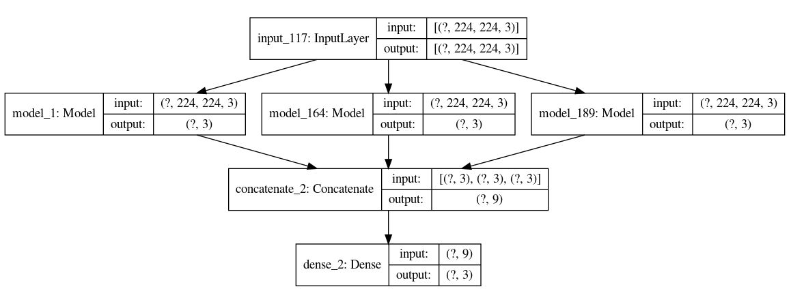

### Ensemble at the last dense layer

This setup gives the network a better chance to learn from the dense layers before the softmax using only **579** trainable parameters.

```
model_densenet_nohead = Model(inputs=model_densenet.input, outputs=model_densenet.get_layer("dense_head").output)
model_efnet_nohead = Model(inputs=model_efnet.input, outputs=model_efnet.get_layer("dense_head").output)
model_vgg_nohead = Model(inputs=model_vgg.input, outputs=model_vgg.get_layer("dense_head_2").output)

for layer in model_densenet_nohead.layers:
  layer.trainable = False

for layer in model_efnet_nohead.layers:
  layer.trainable = False

for layer in model_vgg_nohead.layers:
  layer.trainable = False

visible = tf.keras.layers.Input(shape=(image_size, image_size, 3), name="input")
x1 = model_densenet_nohead(visible)
x2 = model_efnet_nohead(visible)
x3 = model_vgg_nohead(visible)
merge = tf.keras.layers.concatenate([x1, x2, x3], name="concatallprobs")
model_out = tf.keras.layers.Dense(3, activation='softmax', name="predictions")(merge)

model_densenet_efnet_vgg_nohead = Model(inputs=visible, outputs=model_out)
model_densenet_efnet_vgg_nohead.compile(optimizer=tf.keras.optimizers.Adam(learning_rate=0.001),loss='categorical_crossentropy',metrics=['accuracy']) #categorical_smooth_loss
model_densenet_efnet_vgg_nohead.summary()
```

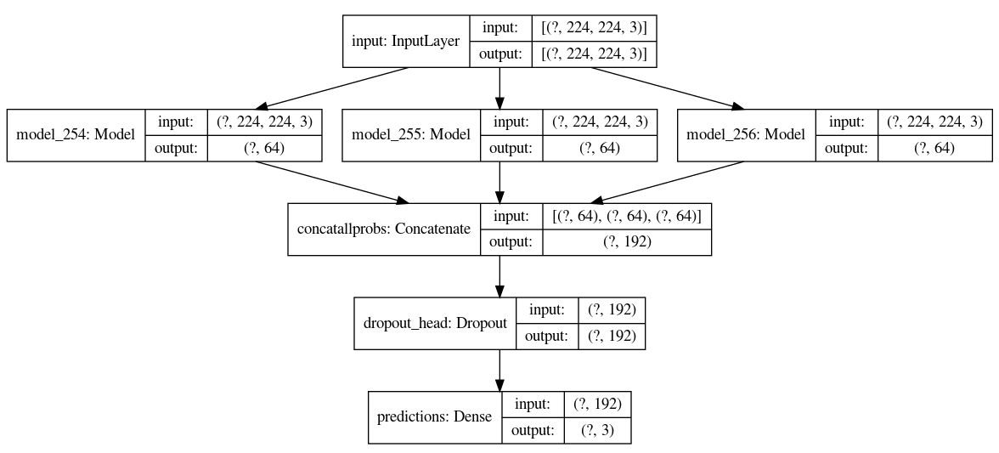

In this setup the final results are marginally better than any of the three models (there is still a room for enhancement)


# Next Steps:
- Use more versions of DenseNet and EfficientNet
- Apply fine fine-tuning on some layers 
- Apply more reasonable data augmentation
- Try Focal Loss with different settings
-  
